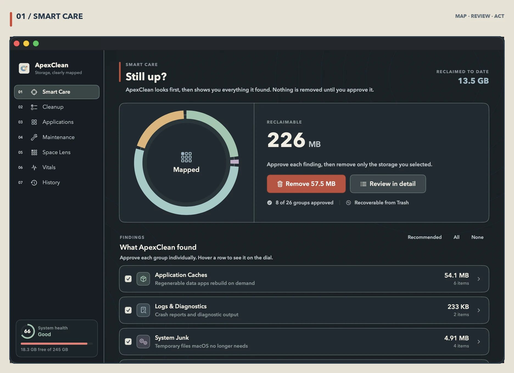
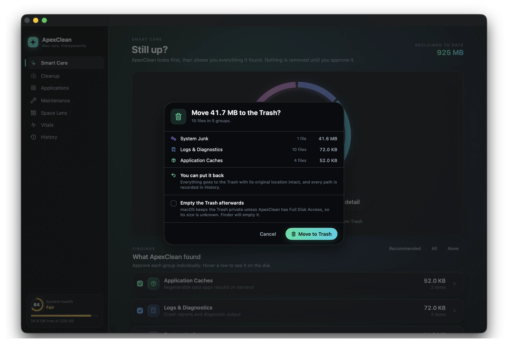
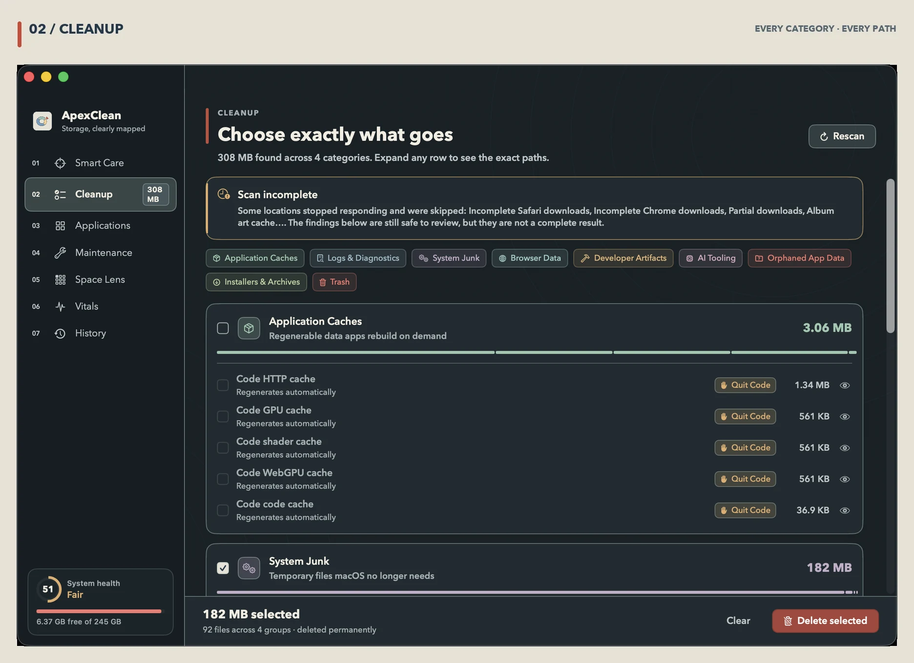
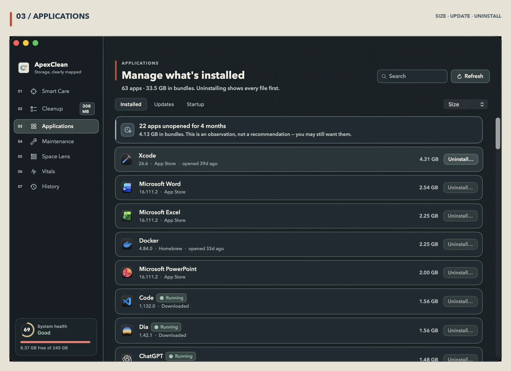
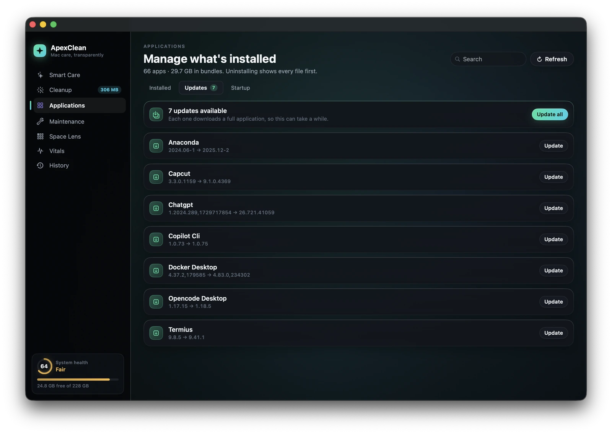
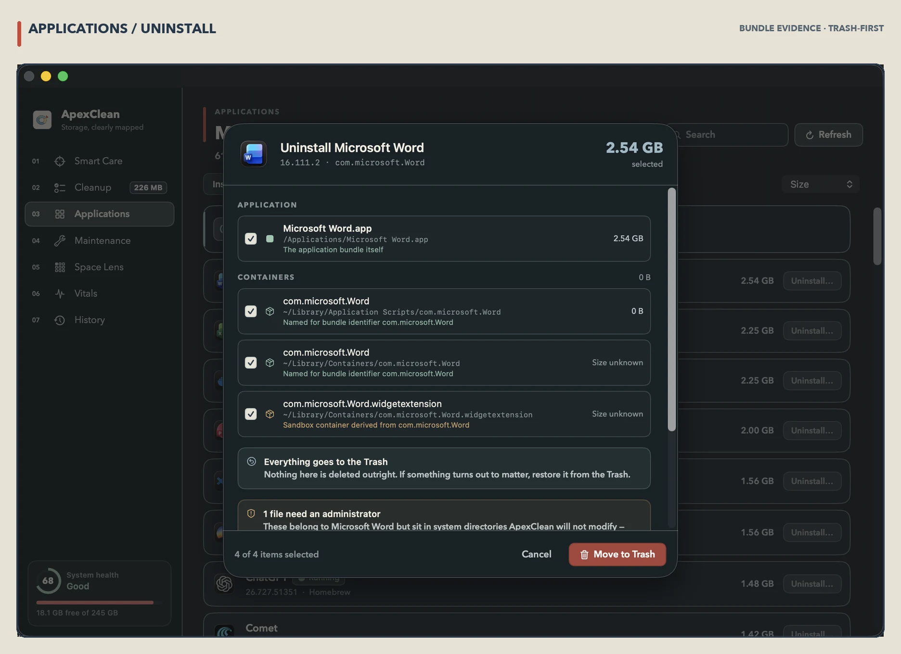
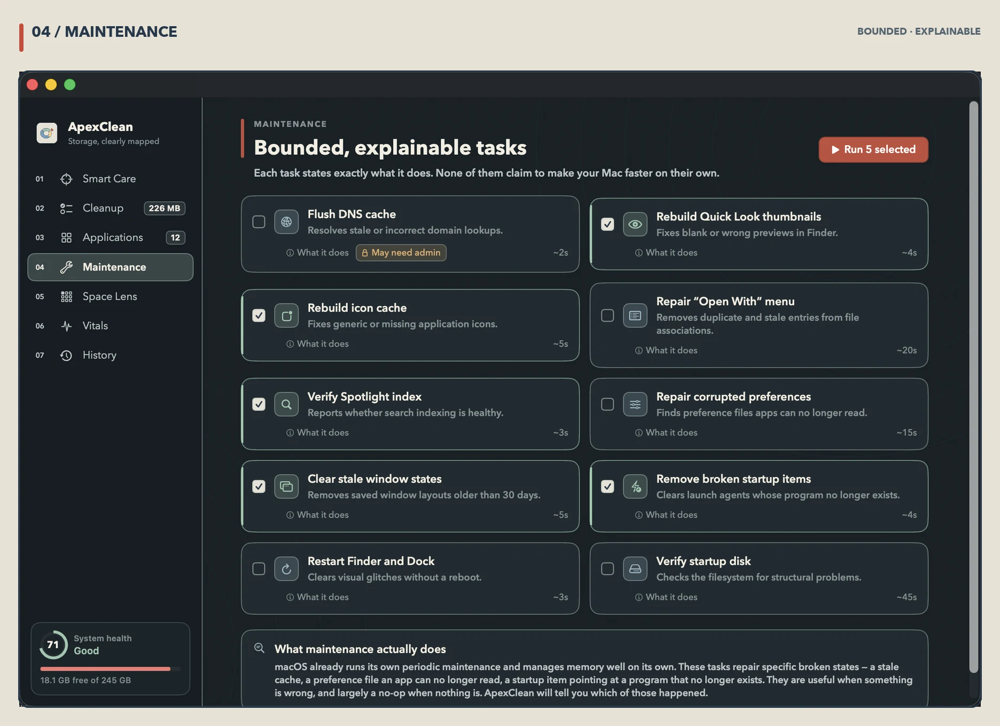
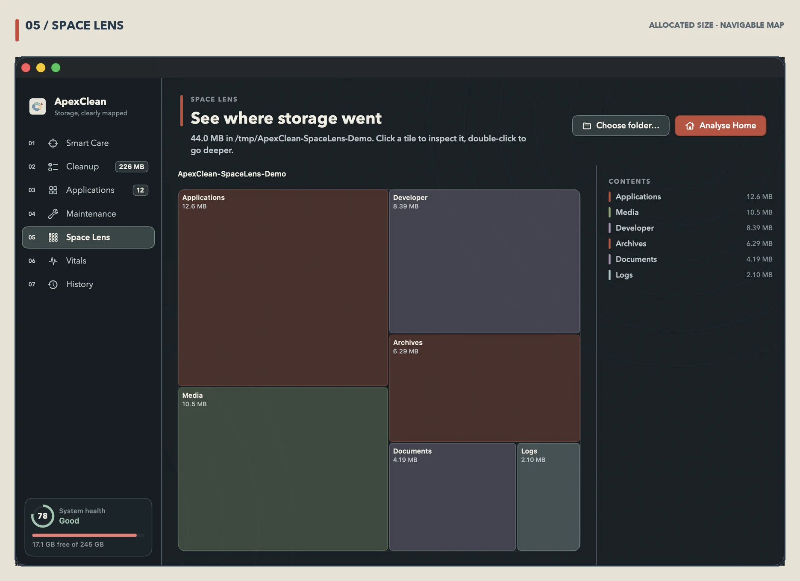
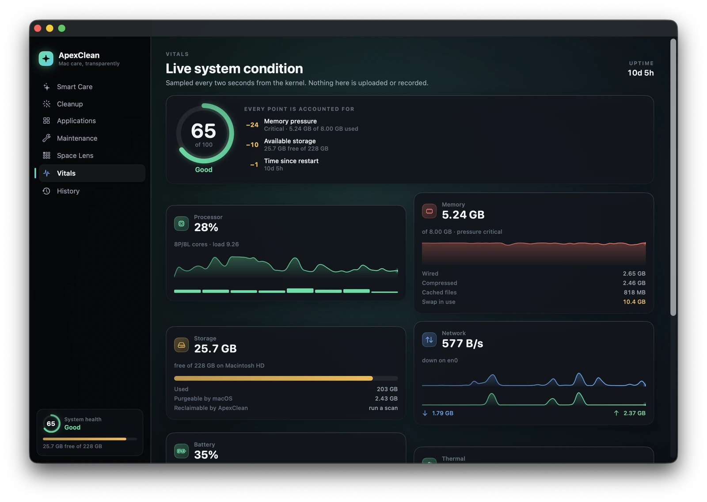
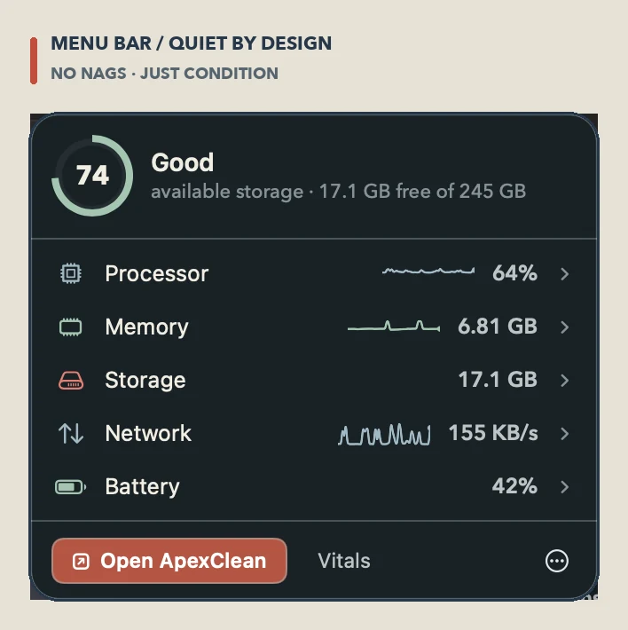

<div align="center">

<br>


<h1>ApexClean</h1>

<h3>Mac care, transparently.</h3>

<p>
A free, native macOS care app that finds reclaimable space, uninstalls apps completely,<br>
runs bounded maintenance, maps your disk and reports live system health —<br>
and shows you <b>everything</b> before it touches <b>anything</b>.
</p>

<p>


</p>

<p>
<a href="#what-it-does"><b>Features</b></a>
&nbsp;·&nbsp;
<a href="#the-safety-model"><b>Safety</b></a>
&nbsp;·&nbsp;
<a href="#privacy"><b>Privacy</b></a>
&nbsp;·&nbsp;
<a href="#build-and-run"><b>Install</b></a>
&nbsp;·&nbsp;
<a href="#architecture"><b>Architecture</b></a>
&nbsp;·&nbsp;
<a href="#license-and-attribution"><b>License</b></a>
</p>

<br>



<br><br>

</div>

---

<div align="center">

### Every cleaner asks you to trust it. This one shows its work.

</div>

<table>
<tr>
<td width="33%" valign="top">

#### It looks before it acts

There is no button that deletes something you haven't seen. Every screen's primary
action is a **scan**. Removal is a second, separate, deliberate act — and it operates
only on the groups you ticked.

</td>
<td width="33%" valign="top">

#### It explains, it doesn't alarm

No red badges, no invented "problems", no inflated savings. If a group is 52 KB it
says 52 KB. If a size can't be measured it says **Size unknown** rather than guessing
zero. Maintenance tasks state what they *won't* fix.

</td>
<td width="33%" valign="top">

#### It fails closed

`PathGuard` is the single choke point in front of every deletion, and it must find an
affirmative reason to allow one. Anything ambiguous is refused, not resolved. Removals
go to the **Trash**, so undo is a drag away.

</td>
</tr>
</table>

<br>

---

## What it does

### Smart Care — one scan, grouped findings

<div align="center">

</div>

One pass across every category. Findings come back **grouped, sized and explained** —
application caches, logs and diagnostics, system junk, browser caches, developer
artifacts, AI tooling, installers, orphaned app data. Each group carries its evidence,
its risk and its recovery behaviour, and each is approved individually.

The confirmation sheet is the last thing between a scan and a deletion, so it is
deliberately unhurried: what is going, how much of it, where it lands, and how to get
it back. Emptying the Trash afterwards is available, opt-in, and honest about the fact
that macOS keeps the Trash private unless the app has Full Disk Access.

<br>

### Cleanup — 428 rules, every path inspectable

<div align="center">

</div>

Filter by category, expand any row to the exact paths, reveal any of them in Finder
before deciding. The catalog is deliberately narrow — it targets the directories
vendors themselves treat as disposable (`Cache`, `GPUCache`, `Code Cache`, `logs`)
rather than whole application-support trees.

<div align="center">

| Category | Rules | | Category | Rules |
|---|---:|:---:|---|---:|
| Application caches | 154 | | AI tooling | 20 |
| Browser data | 136 | | System junk | 18 |
| Developer artifacts | 80 | | Logs · installers · leftovers · Trash | 20 |

</div>

> **Browser data** means shader, GPU and code caches. Not history. Not logins. Not sessions.
> If an app is running, its caches are excluded and labelled — deleting a live app's cache
> is how cleaners corrupt state.

<br>

### Applications — install, update, and actually uninstall

<div align="center">

</div>

Every installed app with its **real on-disk size**, sortable, searchable, with the last
time you opened it. Three tabs: what's installed, what has an update, and what starts
itself at login.

<table>
<tr>
<td width="50%" valign="top">

<p align="center"><b>Updates</b></p>
<p>Outdated apps with the exact version transition, one at a time or all at once,
with live progress. Backed by Homebrew casks when they're available, and clear about
it when they aren't.</p>
</td>
<td width="50%" valign="top">

<p align="center"><b>Uninstall</b></p>
<p>Every leftover shown with the reason it was matched, individually checkable. Nothing
is claimed without evidence — a bundle identifier or a reverse-DNS boundary. Generic
names are refused rather than guessed.</p>
</td>
</tr>
</table>

<br>

### Maintenance — bounded tasks that admit their limits

<div align="center">

</div>

Ten real macOS maintenance operations — flush DNS, rebuild the icon cache, verify the
Spotlight index, repair the "Open With" menu, clear stale window state, remove broken
startup items, verify the boot volume. Each states **what it runs**, roughly how long
it takes, and whether it needs admin rights.

None of them claim to make your Mac faster, because none of them do. They repair
specific broken states, and the app tells you which of those it actually found.

<br>

### Space Lens — a treemap you can navigate

<div align="center">

</div>

An interactive squarified treemap of any folder, measured by **allocated size** — the
space you actually get back, not the logical size. Click a tile to inspect it,
double-click to descend, breadcrumb back out. The side panel keeps a running contents
list and the largest individual files, each one revealable or removable in place.

<br>

### Vitals — live, local, and cheap

<div align="center">

</div>

CPU, memory pressure, storage, network throughput, battery, thermal state, fans,
uptime and top processes, sampled straight from the kernel every two seconds. The
health score is **fully itemised** — every point deducted is listed with the reason
that deducted it, so the number is auditable instead of decorative.

<br>

### Menu bar — quiet by design

<div align="center">

</div>

An opt-in status item with a health ring and expandable metric rows. Expand one to see
what's actually responsible — top processes, memory composition, per-interface
throughput. **No badges, no nags, no recommendations, no red dots.** It sits there and
answers questions when you ask them.

<br>

---

## The safety model

This app deletes files, so it is built to be distrusted.

<table>
<tr>
<td width="50%" valign="top">

**Scan first, always.**
There is no "clean now" button that acts before it looks. The primary action on every
screen is a scan; removal is a second, separate, explicit act.

**Every path goes through one gate.**
`PathGuard.evaluate` is the sole choke point before any removal, and it *fails closed* —
it must find an affirmative reason to allow a deletion and refuses when anything is
ambiguous.

**Validation happens at the syscall boundary.**
Paths are re-resolved and re-checked immediately before the removal call, not just at
scan time. A symlink that changes between scan and confirm cannot redirect a delete.

</td>
<td width="50%" valign="top">

**Trash, not `unlink`.**
Removals go to the Trash wherever macOS allows it. Where Trash is impossible the UI
says so before you confirm.

**Running apps block their own caches.**
If an app is open, its data is excluded and labelled.

**Nothing is remembered that you can't see.**
Every removal is written to a local operation log, visible in History, with path, size
and outcome.

**Ambiguous uninstalls are refused.**
Leftover matching requires bundle-identifier evidence or a reverse-DNS boundary.
Generic names (`com.apple.*`, `helper`, `updater`) are on a refusal list rather than
guessed at.

</td>
</tr>
</table>

<details>
<summary><b>What <code>PathGuard</code> rejects</b></summary>

<br>

- Immovable system paths, and anything above a minimum depth floor
- Mount points and volume roots
- Any path containing a protected fragment
- Endpoint-security vendor paths under `/var/folders`
- Anything outside an explicitly permitted root
- Anything it cannot positively justify — the default answer is *no*

</details>

<br>

---

## Privacy

Local-first, and structurally so: **ApexClean contains no network client.** No
telemetry, no account, no update check, no crash reporter, no analytics SDK. It links
only Apple system frameworks. Nothing about your files or your machine can leave the
device, because there is no code capable of sending it.

It also goes out of its way *not* to ask for permissions.

<details>
<summary><b>Why a cleaner that avoids permission prompts is a better cleaner</b></summary>

<br>

macOS gates Desktop, Documents, Downloads, sandbox containers and media libraries
behind TCC consent. A gated path does not fail cleanly — it **blocks in the kernel**,
with no prompt, no error and no way to cancel the thread. That is precisely how
scanners hang forever.

ApexClean excludes those paths from automatic scans entirely, so no scan you didn't ask
for will ever raise a permission dialog. Including your personal folders is a
deliberate, explained, one-tap opt-in — and everything that touches a gated path runs
under a bounded budget, so a pathological path can cost you a folder but never the app.

</details>

<br>

---

## Build and run

Requires macOS 14+ and a Swift 5.9+ toolchain (Xcode 15 or later).

```sh
git clone https://github.com/ShalomObongo/ApexClean.git
cd ApexClean
make run
```

| Command | What it does |
|---|---|
| `make app` | Build release and assemble `dist/ApexClean.app` |
| `make run` | Build, assemble and launch |
| `make test` | Run the test suite |
| `make clean` | Remove build products |

`make app` produces a self-contained **6.3 MB** `dist/ApexClean.app`. There is no Xcode
project — the whole build is a SwiftPM package plus `Scripts/bundle.sh`, so a checkout
builds identically anywhere with no IDE state involved.

The bundled build is **ad-hoc signed**, which is enough to run locally. A distribution
build substitutes a Developer ID identity and runs `notarytool`; see the comment at the
bottom of `Scripts/bundle.sh`.

> **Optional permissions.** ApexClean works without granting it anything. Two things
> improve if you do grant **Full Disk Access**: the Trash becomes measurable (macOS
> hides its size otherwise), and sandbox containers can be sized during an uninstall
> review instead of being reported as *Size unknown*. Updating apps installed as
> Homebrew casks may additionally prompt for **App Management**.

<br>

---

## Architecture

```
Sources/
├── ApexCore/                  Engine. Zero UI, fully testable.
│   ├── Support/               Byte formatting, bounded shell, Guarded, allocated size
│   ├── Safety/                PathGuard, PrivacyAccess, Remover
│   ├── Cleanup/               CleanupCatalog (428 rules), CleanupScanner, Glob
│   ├── Apps/                  AppInventory, LeftoverFinder, StartupInventory
│   ├── Maintenance/           MaintenanceCatalog + runner
│   ├── Disk/                  SpaceScanner, LargeFileFinder, Treemap
│   ├── Vitals/                CPU/Memory/Storage/Network/Power/Process, HealthScore
│   └── History/               OperationLog
└── ApexClean/                 SwiftUI app
    ├── Design/                Palette, Typography, Motion, components
    ├── Features/              One model + one view per screen
    ├── MenuBar/               HUD
    └── App/                   AppState, RootView, About
```

The engine never imports SwiftUI and the UI never touches the filesystem directly. That
split is what makes the destructive logic testable in isolation.

### Performance

Low resource use is a product requirement, not an aspiration — a maintenance utility
that costs you performance is self-defeating. Measured on an M-series Mac, as a share
of one core:

| State | CPU | Memory |
|---|:---:|:---:|
| Window hidden or fully covered | **~0.3%** | ~60 MB |
| Window open, static screen | **~0.7%** | ~63 MB |
| Window open on the live Vitals dashboard | **~5%** | ~71 MB |

<details>
<summary><b>The four things that got it there</b></summary>

<br>

**Ambient motion runs on Core Animation, not SwiftUI.**
A continuously animating SwiftUI view re-runs layout and render every display cycle,
forever. The aurora backdrop and the orbiting scan arc are `NSViewRepresentable`
wrappers around `CABasicAnimation` on pre-rendered `CALayer`s, so the work happens in
the render server and the app process stays idle. `AuroraBackdrop.swift` documents this
at length — it is not a candidate for "simplification" back to SwiftUI.

**Sampling stops when nobody can see it.**
Live metrics run at two seconds while a window is on screen and drop to ten as soon as
the app is hidden, minimised or fully occluded — three separate macOS events, none of
which implies the others, all merged in `WindowVisibility.swift`. An app left open all
day should cost approximately nothing while it sits there.

**Charts draw; they do not lay out.**
`Sparkline` is a single `Canvas`, not a `GeometryReader` wrapping stacked shapes.
Profiling put SwiftUI's stack layout at the top of the main thread — four charts
rebuilding a view tree on every sample was most of the cost of the whole screen.

**Blocking I/O never runs on the cooperative pool.**
Scans run off the main thread and progress updates are coalesced to ~20/s. Every
cleanup rule runs under a watchdog with a bounded budget; every directory listing goes
through `GuardedDirectoryLister`, which replaces its worker queue if a listing does not
return. A `read` blocked on a TCC-gated path cannot be cancelled, and one wedged job at
the head of a serial queue would otherwise swallow every job behind it.

</details>

<br>

---

## Testing

```sh
swift test
```

**110 tests** covering `PathGuard` refusals, `PrivacyAccess` gating, traversal fences,
bounded execution, guarded directory listing, leftover-matching precision, uninstall
plan invariants, catalog invariants, treemap layout, health scoring and byte formatting.

> One caveat worth knowing: `xctest` inherits the terminal's TCC grants, so a scan that
> would block on a consent dialog inside the app runs fine under test. Permission
> behaviour must be verified in the bundled app, not in the suite.

<br>

---

## License and attribution

ApexClean is licensed under the **GNU General Public License v3.0**. See [LICENSE](LICENSE).

It is built on [**Mole**](https://github.com/tw93/mole) by [Tw93](https://github.com/tw93) —
an excellent GPL-3.0 macOS maintenance CLI. ApexClean's cleanup path catalog,
path-protection boundaries, leftover-matching rules, maintenance task set and health
scoring were all studied from Mole's source and reimplemented in Swift. Mole did the
hard, unglamorous work of figuring out what is actually safe to delete on a Mac, and
this app would not exist without it. [NOTICE](NOTICE) records exactly what was adapted
and where it now lives.

ApexClean is an independent project. It is not affiliated with or endorsed by Mole, and
it is unrelated to the separate proprietary *Mole for Mac* application. No Mole source,
trademarks or trade dress are redistributed here; the interface, visual language,
interaction model and product identity are original work.

<br>

<div align="center">


<p><b>ApexClean</b> · Mac care, transparently.<br>
<sub>Free software. No telemetry. Trash-first. Fails closed.</sub></p>

</div>
